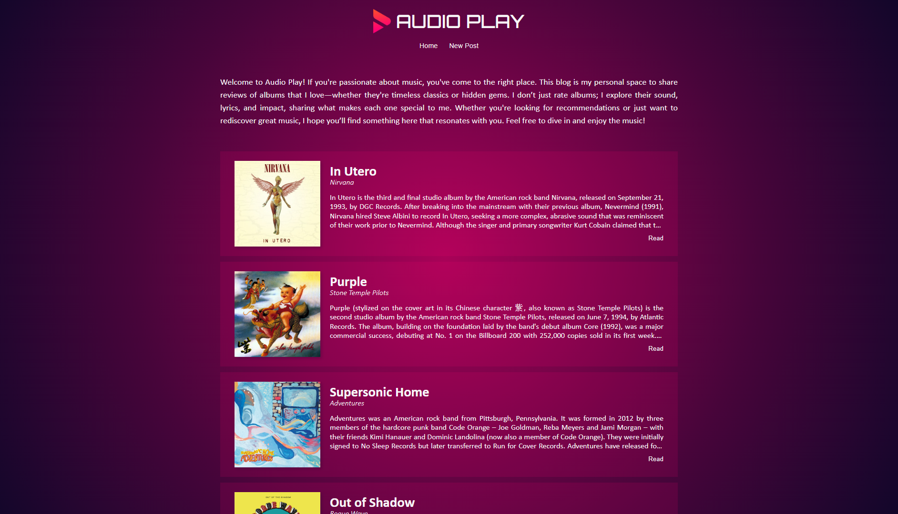
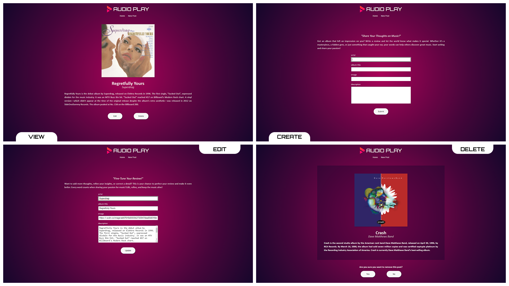

<p align="center">
  
</p>

<p align="center">
 <a href="#funcionalidades">Funcionalidades</a> •
 <a href="#demonstração">Demonstração</a> • 
 <a href="#como-executar">Como executar</a> • 
 <a href="#tecnologias">Tecnologias</a> • 
 <a href="#autoria">Autoria</a>
</p><br>

# Audio Play

O projeto é um blog de reviews de álbuns. Compartilhar as opiniões do usuário sobre discos que ele curte. Cada post inclui o nome do álbum, capa, artista e uma análise pessoal permitindo a quem acessa ter a oportunidade de conhecer músicas novas de diferentes estilos e artistas.

## Funcionalidades

- Visualizar a lista de posts paginada em cinco posts por página;
- Visualizar os detalhes de um post específico;
- Inserir um novo post com nome do artista, nome do álbum, capa e uma descrição;
- Editar um post podendo alterar qualquer uma de suas características;
- Remover um post não desejado.

## Demonstração

<p align="center">
  
  <em>Home</em>
</p>

<p align="center">
  
  <em>View, Create, Edit e Delete</em>
</p>

## Como executar

```Bash
# Clone este repositório
$ https://github.com/TiLourinho/blog-audio-play

# Instale as dependências
$ npm install

# Inicie o servidor
$ npm start
```

O projeto estará rodando no endereço http://localhost:3000/1

## Tecnologias

- [Node.js](https://nodejs.org/pt)
- [Express](https://expressjs.com/pt-br/)
- [EJS](https://ejs.co/)

## Autoria

Tiago Lourinho

[](mailto:lourinho.tiago@gmail.com)
